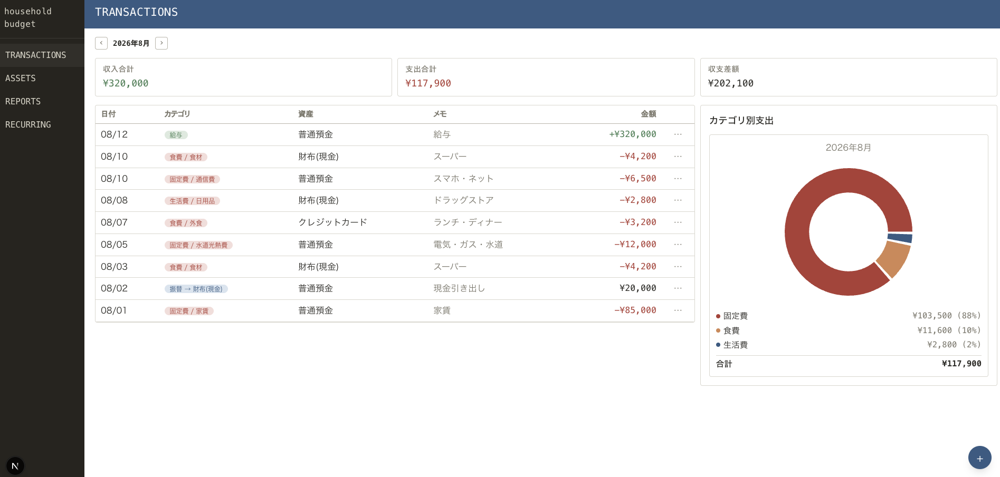
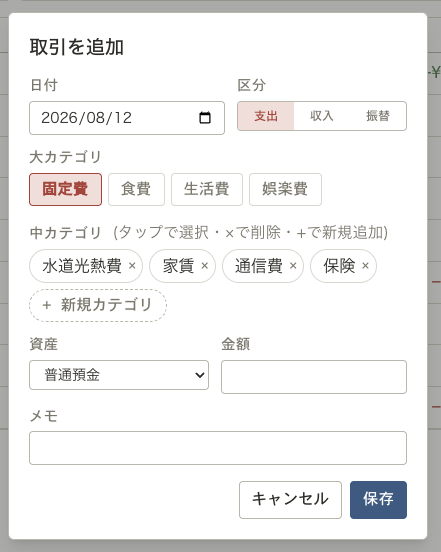
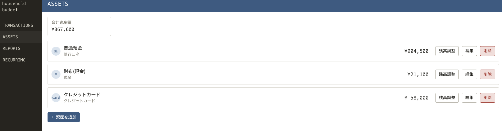
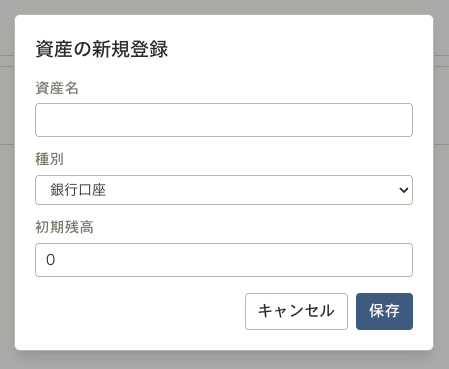
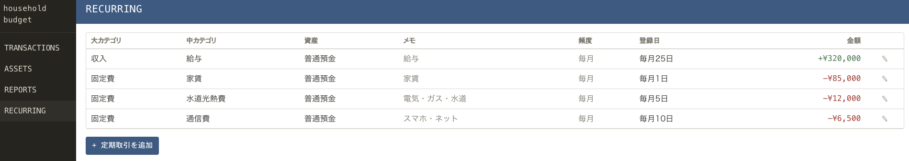
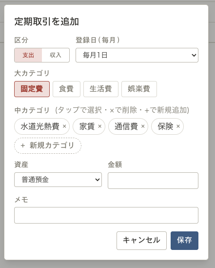
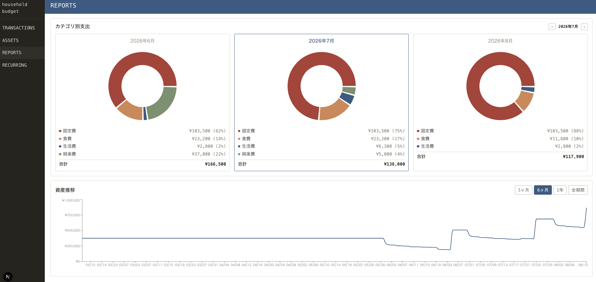

# HouseholdBudget

マネーフォワード ME のような個人向け家計簿Webアプリケーション。銀行・クレジットカード連携による自動取得は行わず、手動入力を前提とすることで、自分の生活に合わせたカテゴリ設計や機能を自由にカスタマイズできることを目指した学習課題として開発している。

個人(単一ユーザー)での利用を前提に、以下の機能を備える。

- **取引管理**: 収入・支出を日付/金額/カテゴリ/資産/メモ付きで記録し、月別に一覧表示する
- **資産管理**: 銀行口座・現金・クレジットカードを資産として登録し、残高を一元管理する。実際の残高を入力するだけで差額を自動的に取引として記録する「残高調整」、資産間でお金を移動する「振替」にも対応
- **定期取引**: 家賃・サブスクなど毎月発生する取引を登録しておくと、該当日に自動で取引として登録される
- **レポート**: 月別収支サマリ、カテゴリ別支出、資産全体の残高推移をグラフで可視化する

詳細な背景・機能要件は [docs/requirements.md](docs/requirements.md) を参照。

## デモ

<!-- TODO: アプリの動作確認用スクリーンショット・画面録画をここに貼り付ける -->

## 画面と使い方

左側のメニューから4つの画面を切り替えて操作する。

### TRANSACTIONS(取引)



月別の取引一覧画面。ヘッダーの `<` `>` で表示月を切り替えられる。上部に当月の収入合計・支出合計・収支差額、右側にカテゴリ別支出の内訳グラフを表示する。右下の `+` ボタンから取引を追加できる。



取引追加時は、区分(支出・収入・振替)、日付、大カテゴリ・中カテゴリ、資産、金額、メモを入力する。「振替」を選ぶと資産間の残高移動として登録され、収支には計上されない。一覧の各行の「…」からは編集・削除ができる。

### ASSETS(資産)



登録済みの資産(銀行口座・現金・クレジットカードなど)と残高の一覧、合計資産額を表示する。「資産を追加」から新しい資産を登録できる。



資産名・種別・初期残高を入力して登録する。登録済みの資産は「編集」で内容変更、「削除」で削除、「残高調整」で実際の残高との差額を調整取引として自動登録できる(例: 実残高と記録上の残高がずれた場合に、差額分の取引を手入力せずに一致させる)。

### RECURRING(定期取引)



家賃・給与・水道光熱費など毎月発生する取引をあらかじめ登録しておく画面。登録しておくと該当日に自動で取引として登録される。「定期取引を追加」から新規登録できる。



区分(支出・収入)、登録日(毎月何日に発生するか)、大カテゴリ・中カテゴリ、資産、金額、メモを入力する。中カテゴリは選択済みのタグをタップで選択、`×`で削除、「+ 新規カテゴリ」で追加できる。一覧の鉛筆アイコンから編集できる。

### REPORTS(レポート)



カテゴリ別支出(前後の月と並べて比較でき、`<` `>` で表示月をスライド)、資産全体の残高推移(3ヶ月・6ヶ月・1年・全期間で切り替え)をグラフで確認できる。

## ドキュメント

| ドキュメント | 内容 |
|--------------|------|
| [docs/requirements.md](docs/requirements.md) | 要件定義書。想定利用者、機能要件、データ項目など |
| [docs/basic-design.md](docs/basic-design.md) | 基本設計書。技術スタック、API設計、DB物理設計、ディレクトリ構成 |
| [docs/wireframes.html](docs/wireframes.html) | 画面のワイヤーフレーム(配色・タイポグラフィの決定にも使用) |

## 技術スタック

| 領域 | 技術 |
|------|------|
| バックエンド | Python 3.12+ / FastAPI / SQLAlchemy / Alembic / uv |
| フロントエンド | Next.js(App Router) / TypeScript / Tailwind CSS(CSR中心のSPA構成) |
| データベース | MySQL 8.0(Docker Composeで起動) |

選定理由の詳細は [docs/basic-design.md 1章](docs/basic-design.md#1-技術スタック) を参照。

## ディレクトリ構成

```
.
├── backend/    # FastAPI(REST API)
├── frontend/   # Next.js(画面)
└── docs/       # 要件定義書・基本設計書・ワイヤーフレーム
```

バックエンド・フロントエンドそれぞれの内部構成は [docs/basic-design.md 5章](docs/basic-design.md#5-ディレクトリ構成) を参照。

## セットアップ

### 前提

- Python 3.12+
- uv(Pythonパッケージ管理)
- Node.js(npm)
- Docker(MySQLをコンテナで起動するため)

### 1. データベースの起動

```bash
cd backend
docker compose up -d
```

`backend/docker-compose.yml` により、MySQL 8.0 がポート `3306` で起動する(DB名・ユーザー名・パスワードは `household_budget` / `household` / `household`)。

### 2. バックエンドの起動(ポート8000)

```bash
cd backend
uv run alembic upgrade head
uv run uvicorn app.main:app --reload
```

起動後、以下で疎通確認・API仕様確認ができる。

- Swagger UI: `http://localhost:8000/docs`

### 3. フロントエンドの起動(ポート3000)

```bash
cd frontend
npm install
npm run dev
```

`http://localhost:3000/` にアクセスすると取引一覧画面が表示される。

> [!IMPORTANT]
> フロントエンドは `http://localhost:8000` (既定ポート)のバックエンドにAPIリクエストする構成のため、両方とも既定ポート(バックエンド`8000`／フロントエンド`3000`)で起動すること。ポート競合時に別ポートへフォールバックしたまま起動すると、通信が成立せず正しく動作しない。

## API

APIのエンドポイント一覧・リクエスト/レスポンス例は [docs/basic-design.md 4章](docs/basic-design.md#4-api設計) を参照。起動中は Swagger UI(`http://localhost:8000/docs`)でも同じ内容を確認・実行できる。

## 開発ルール

Issue駆動・PRベースの開発フローに従う。詳細は [CLAUDE.md](CLAUDE.md) を参照。
