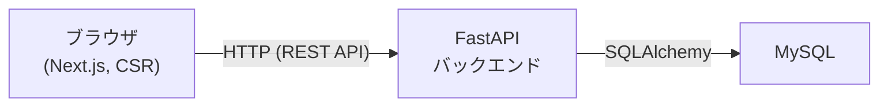
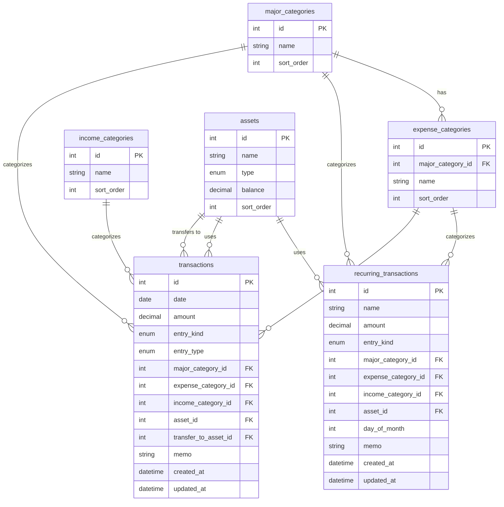

# 家計簿アプリケーション 基本設計書

## 目次

- [1. 技術スタック](#1-技術スタック)
  - [1.1 バックエンド](#11-バックエンド)
  - [1.2 フロントエンド](#12-フロントエンド)
  - [1.3 データベース](#13-データベース)
  - [1.4 インフラ・デプロイ](#14-インフラデプロイ)
- [2. アーキテクチャ方針](#2-アーキテクチャ方針)
- [3. DB物理設計](#3-db物理設計)
  - [3.1 ER図](#31-er図)
  - [3.2 テーブル定義](#32-テーブル定義)
- [4. API設計](#4-api設計)
  - [4.1 共通仕様](#41-共通仕様)
  - [4.2 エンドポイント一覧](#42-エンドポイント一覧)
  - [4.3 リクエスト/レスポンス例](#43-リクエストレスポンス例)
- [5. ディレクトリ構成](#5-ディレクトリ構成)
  - [5.1 backend/](#51-backend)
  - [5.2 frontend/](#52-frontend)
- [6. 今後詳細化する項目](#6-今後詳細化する項目)

---

## 1. 技術スタック

TaskManagement(タスク管理アプリ)ではJava/Spring Boot + React + PostgreSQLを採用したが、
本プロジェクトは学習課題として別の技術スタックに挑戦する。

### 1.1 バックエンド

| 項目 | 選定 |
|------|------|
| 言語 | Python |
| フレームワーク | FastAPI |
| ORM | SQLAlchemy |
| マイグレーション | Alembic |
| パッケージ管理 | uv |

FastAPIは型ヒントベースのバリデーション・自動API仕様書生成(Swagger UI)を持ち、学習コストを抑えつつ
実務水準の書き方を学べるため採用する。

### 1.2 フロントエンド

| 項目 | 選定 |
|------|------|
| フレームワーク | Next.js(App Router) |
| 言語 | TypeScript |
| レンダリング方式 | クライアントサイドレンダリング(CSR)中心。Next.js固有のSSR・Server Components・Server Actionsは使用せず、FastAPIのAPIをブラウザから直接呼び出すSPAとして構成する |
| パッケージ管理 | npm |

Next.jsはフロントエンド求人での需要が高く学習価値が大きいため採用する。ただしSSR等のサーバー側機能は
バックエンド(FastAPI)との役割分担を複雑にするため、本プロジェクトでは使用しない方針とする。

### 1.3 データベース

| 項目 | 選定 |
|------|------|
| DBMS | MySQL |

### 1.4 インフラ・デプロイ

- 開発初期はローカル環境での動作確認を中心に進める
- MVP実装が一段落した後、TaskManagementと同様にAWS(EC2 + RDS)へTerraformでデプロイする
  - 個人利用・単一ユーザー・認証なしを前提とした構成とする
  - AWS無料枠(12ヶ月)の範囲に収まる構成とする(EC2は`t3.micro`、RDSは`db.t3.micro`等)
  - ロードバランサー・NAT Gateway・ECRなど追加コスト/複雑さの要因となるリソースは作らない
- 詳細なAWS構成は、MVP実装後に別途インフラ構成書として整備する

## 2. アーキテクチャ方針



- 認証機能は持たない(個人利用・単一ユーザー前提)
- フロントエンド(Next.js)とバックエンド(FastAPI)は別サーバーとして分離し、REST APIで通信する
- 機密データの取り扱いは[CLAUDE.md](../CLAUDE.md)・[要件定義書 4章](requirements.md#4-非機能要件)に従う

## 3. DB物理設計

[要件定義書 6章](requirements.md#6-データ項目案)のデータ項目案を元に、テーブル構成を確定する。

### 3.1 ER図



- 認証・ユーザー管理は行わないため、全テーブルに`user_id`等は持たない([2. アーキテクチャ方針](#2-アーキテクチャ方針)参照)
- 収入取引には大カテゴリの概念がないため、`transactions`/`recurring_transactions`の`major_category_id`は支出時のみ設定する(収入時はNULL)
- 論理削除・履歴管理は行わない(要件定義書「7. スコープ外・将来拡張」参照)。削除は物理削除とする

### 3.2 テーブル定義

#### major_categories(支出の大カテゴリ)

固定4件(固定費・食費・生活費・娯楽費)。追加・編集・削除機能は持たず、初期データ(シード)として投入する。

| カラム名 | 型 | 制約 | 内容 |
|---------|-----|------|------|
| id | INT | PK, AUTO_INCREMENT | |
| name | VARCHAR(50) | NOT NULL, UNIQUE | 大カテゴリ名(例: 固定費) |
| sort_order | INT | NOT NULL | 表示順 |

#### expense_categories(支出の中カテゴリ)

| カラム名 | 型 | 制約 | 内容 |
|---------|-----|------|------|
| id | INT | PK, AUTO_INCREMENT | |
| major_category_id | INT | NOT NULL, FK → major_categories.id | 所属する大カテゴリ |
| name | VARCHAR(50) | NOT NULL | 中カテゴリ名(例: 水道光熱費) |
| sort_order | INT | NOT NULL | 表示順 |

- `(major_category_id, name)`に一意制約を設ける(同一大カテゴリ内での名称重複を防ぐ)

#### income_categories(収入カテゴリ)

大カテゴリの階層を持たないフラットな1階層。

| カラム名 | 型 | 制約 | 内容 |
|---------|-----|------|------|
| id | INT | PK, AUTO_INCREMENT | |
| name | VARCHAR(50) | NOT NULL, UNIQUE | カテゴリ名(例: 給与) |
| sort_order | INT | NOT NULL | 表示順 |

#### assets(資産)

| カラム名 | 型 | 制約 | 内容 |
|---------|-----|------|------|
| id | INT | PK, AUTO_INCREMENT | |
| name | VARCHAR(50) | NOT NULL | 資産名(例: 三井住友銀行) |
| type | ENUM('bank','cash','credit_card') | NOT NULL | 資産種別 |
| balance | DECIMAL(12,0) | NOT NULL, DEFAULT 0 | 現在残高(円単位、小数は扱わない) |
| sort_order | INT | NOT NULL | 表示順 |

- `balance`は取引の登録・編集・削除のたびにアプリケーション側で再計算・更新する非正規化カラム(毎回集計するのではなく、表示速度を優先する)

#### transactions(取引)

| カラム名 | 型 | 制約 | 内容 |
|---------|-----|------|------|
| id | INT | PK, AUTO_INCREMENT | |
| date | DATE | NOT NULL | 取引日 |
| amount | DECIMAL(12,0) | NOT NULL | 金額(正の値のみ。収入/支出/振替は`entry_kind`で区別) |
| entry_kind | ENUM('income','expense','transfer') | NOT NULL | 収入/支出/振替区分 |
| entry_type | ENUM('normal','adjustment') | NOT NULL, DEFAULT 'normal' | 登録種別(通常入力/資産残高調整による自動登録) |
| major_category_id | INT | NULL, FK → major_categories.id | 大カテゴリ(`entry_kind='expense'`時のみ設定) |
| expense_category_id | INT | NULL, FK → expense_categories.id | 支出中カテゴリ(`entry_kind='expense'`時のみ設定) |
| income_category_id | INT | NULL, FK → income_categories.id | 収入カテゴリ(`entry_kind='income'`時のみ設定) |
| asset_id | INT | NOT NULL, FK → assets.id | 紐づく資産(振替の場合は移動元) |
| transfer_to_asset_id | INT | NULL, FK → assets.id | 振替の移動先資産(`entry_kind='transfer'`時のみ設定) |
| memo | VARCHAR(255) | NULL | メモ |
| created_at | DATETIME | NOT NULL | 作成日時 |
| updated_at | DATETIME | NOT NULL | 更新日時 |

- `entry_kind='expense'`のとき`expense_category_id`必須・`income_category_id`はNULL、`entry_kind='income'`のとき逆、`entry_kind='transfer'`のときは大カテゴリ・支出中カテゴリ・収入カテゴリすべてNULLで`transfer_to_asset_id`必須(`asset_id`と異なる資産)、をアプリケーション層(Pydanticバリデーション)で保証する
- `entry_type='adjustment'`の行は資産残高調整時にアプリケーションが自動生成する(要件定義書 3.4参照)。カテゴリは初期状態でNULLとし、後から他の取引と同様に編集できる
- 振替(`entry_kind='transfer'`)は移動元資産の残高を減算・移動先資産の残高を加算する。月別収支サマリの収入合計・支出合計、カテゴリ別支出集計には含めない(要件定義書 3.4参照)
- 月別一覧表示のため`date`にINDEXを張る

#### recurring_transactions(定期取引)

| カラム名 | 型 | 制約 | 内容 |
|---------|-----|------|------|
| id | INT | PK, AUTO_INCREMENT | |
| name | VARCHAR(50) | NOT NULL | 定期取引名(例: 家賃) |
| amount | DECIMAL(12,0) | NOT NULL | 金額 |
| entry_kind | ENUM('income','expense') | NOT NULL | 収入/支出区分 |
| major_category_id | INT | NULL, FK → major_categories.id | 大カテゴリ(支出時のみ) |
| expense_category_id | INT | NULL, FK → expense_categories.id | 支出中カテゴリ(支出時のみ) |
| income_category_id | INT | NULL, FK → income_categories.id | 収入カテゴリ(収入時のみ) |
| asset_id | INT | NOT NULL, FK → assets.id | 紐づく資産 |
| day_of_month | INT | NOT NULL | 毎月何日に取引として登録するか(1〜31。月末日が存在しない月は月末日に登録する) |
| memo | VARCHAR(255) | NULL | メモ |
| created_at | DATETIME | NOT NULL | 登録日 |
| updated_at | DATETIME | NOT NULL | 更新日時 |

- 頻度は「毎月」のみ対応(要件定義書 3.3参照)のため`frequency`カラムは持たず、`day_of_month`で表現する
- 該当日になったら`transactions`へ`entry_type='normal'`の取引を1件自動登録する(登録済みかどうかの判定方法・バッチ実行方式はMVP実装時に確定する)

## 4. API設計

### 4.1 共通仕様

| 項目 | 内容 |
|------|------|
| ベースパス | `/api` |
| 形式 | JSON(リクエスト・レスポンスともに`application/json`) |
| 日付形式 | `YYYY-MM-DD`(ISO 8601) |
| 認証 | なし(個人利用・単一ユーザー前提) |
| エラーレスポンス | `{"detail": "エラーメッセージ"}`(FastAPI標準形式) |
| API仕様書 | FastAPI自動生成のSwagger UI(`/docs`)を正とし、本書は一覧性のための概要のみ記載する |

### 4.2 エンドポイント一覧

| メソッド | パス | 概要 |
|---------|------|------|
| GET | `/api/transactions` | 取引一覧取得(`year`・`month`クエリで月別絞り込み) |
| POST | `/api/transactions` | 取引の新規登録 |
| PUT | `/api/transactions/{id}` | 取引の編集 |
| DELETE | `/api/transactions/{id}` | 取引の削除 |
| GET | `/api/summary/monthly` | 月別収支サマリ取得(`year`・`month`クエリ必須) |
| GET | `/api/reports/category-breakdown` | 月別・大カテゴリ別支出集計取得(`year`・`month`クエリ必須) |
| GET | `/api/reports/asset-trend` | 資産全体の残高推移取得(`months`クエリで期間切替、3・6・12から指定) |
| GET | `/api/assets` | 資産一覧取得(残高・合計資産額を含む) |
| POST | `/api/assets` | 資産の新規登録 |
| PUT | `/api/assets/{id}` | 資産の編集 |
| DELETE | `/api/assets/{id}` | 資産の削除 |
| POST | `/api/assets/{id}/adjust` | 資産残高調整(実際の残高を受け取り、差額の調整取引を自動登録) |
| GET | `/api/recurring-transactions` | 定期取引一覧取得 |
| POST | `/api/recurring-transactions` | 定期取引の新規登録 |
| PUT | `/api/recurring-transactions/{id}` | 定期取引の編集 |
| DELETE | `/api/recurring-transactions/{id}` | 定期取引の削除 |
| GET | `/api/major-categories` | 支出大カテゴリ一覧取得(固定4件、参照のみ) |
| GET | `/api/expense-categories` | 支出中カテゴリ一覧取得 |
| POST | `/api/expense-categories` | 支出中カテゴリの新規登録 |
| DELETE | `/api/expense-categories/{id}` | 支出中カテゴリの削除 |
| GET | `/api/income-categories` | 収入カテゴリ一覧取得 |
| POST | `/api/income-categories` | 収入カテゴリの新規登録 |
| DELETE | `/api/income-categories/{id}` | 収入カテゴリの削除 |

### 4.3 リクエスト/レスポンス例

代表的なエンドポイントの例を示す。その他は同様の構造に準じる(詳細は実装時にSwagger UIで確定)。

**GET `/api/transactions?year=2026&month=8`**

```json
{
  "items": [
    {
      "id": 1,
      "date": "2026-08-05",
      "amount": 3200,
      "entry_kind": "expense",
      "entry_type": "normal",
      "major_category_id": 2,
      "expense_category_id": 12,
      "income_category_id": null,
      "asset_id": 1,
      "memo": "スーパーで食材"
    }
  ]
}
```

**POST `/api/transactions`**

```json
{
  "date": "2026-08-05",
  "amount": 3200,
  "entry_kind": "expense",
  "major_category_id": 2,
  "expense_category_id": 12,
  "asset_id": 1,
  "memo": "スーパーで食材"
}
```

**GET `/api/summary/monthly?year=2026&month=8`**

```json
{
  "year": 2026,
  "month": 8,
  "income_total": 300000,
  "expense_total": 180000,
  "balance": 120000
}
```

**POST `/api/assets/{id}/adjust`**

```json
{
  "actual_balance": 50000
}
```

レスポンスは差額から自動生成された`entry_type=adjustment`の取引と、更新後の資産情報を返す。

## 5. ディレクトリ構成

### 5.1 backend/

```
backend/
├── app/
│   ├── main.py               # FastAPIエントリポイント
│   ├── core/
│   │   └── config.py         # 環境変数・設定
│   ├── db/
│   │   ├── base.py           # SQLAlchemy Base・モデル集約
│   │   └── session.py        # DBセッション
│   ├── models/                # SQLAlchemyモデル(テーブル定義に対応)
│   ├── schemas/                # Pydanticスキーマ(リクエスト/レスポンス)
│   ├── crud/                   # DBアクセス処理
│   └── api/
│       └── routes/             # エンドポイント定義(transactions.py 等)
├── alembic/
│   └── versions/               # マイグレーションファイル
├── tests/
└── pyproject.toml
```

### 5.2 frontend/

```
frontend/
├── src/
│   ├── app/                    # Next.js App Router(画面単位のディレクトリ)
│   │   ├── transactions/       # 取引一覧(月別)。カテゴリの追加・削除は取引追加・編集モーダルに統合
│   │   ├── assets/             # 資産一覧
│   │   ├── reports/            # レポート(カテゴリ別集計・資産推移)
│   │   └── recurring-transactions/  # 定期取引管理
│   ├── components/             # 共通UIコンポーネント(取引追加・編集モーダル等)
│   ├── lib/                    # APIクライアント等
│   └── types/                  # 型定義(APIレスポンス型等)
├── public/
└── package.json
```

## 6. 今後詳細化する項目

- 定期取引の自動登録処理の実行方式(バッチ・スケジューラの具体的な仕組み)
- Alembicマイグレーションの初期スキーマ・シードデータ投入方法
