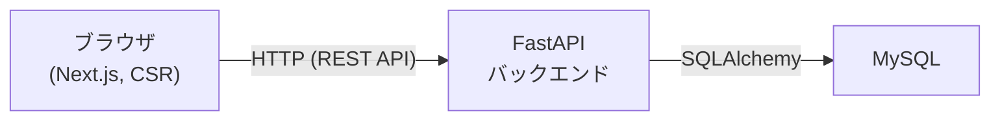

# 家計簿アプリケーション 基本設計書

## 目次

- [1. 技術スタック](#1-技術スタック)
  - [1.1 バックエンド](#11-バックエンド)
  - [1.2 フロントエンド](#12-フロントエンド)
  - [1.3 データベース](#13-データベース)
  - [1.4 インフラ・デプロイ](#14-インフラデプロイ)
- [2. アーキテクチャ方針](#2-アーキテクチャ方針)
- [3. 今後詳細化する項目](#3-今後詳細化する項目)

---

## 1. 技術スタック

TaskManagement(タスク管理アプリ)ではJava/Spring Boot + React + PostgreSQLを採用したが、
本プロジェクトは学習課題として別の技術スタックに挑戦する。

### 1.1 バックエンド

| 項目 | 選定 |
|------|------|
| 言語 | Python |
| フレームワーク | FastAPI |
| ORM | SQLAlchemy |
| マイグレーション | Alembic |
| パッケージ管理 | uv |

FastAPIは型ヒントベースのバリデーション・自動API仕様書生成(Swagger UI)を持ち、学習コストを抑えつつ
実務水準の書き方を学べるため採用する。

### 1.2 フロントエンド

| 項目 | 選定 |
|------|------|
| フレームワーク | Next.js(App Router) |
| 言語 | TypeScript |
| レンダリング方式 | クライアントサイドレンダリング(CSR)中心。Next.js固有のSSR・Server Components・Server Actionsは使用せず、FastAPIのAPIをブラウザから直接呼び出すSPAとして構成する |
| パッケージ管理 | npm |

Next.jsはフロントエンド求人での需要が高く学習価値が大きいため採用する。ただしSSR等のサーバー側機能は
バックエンド(FastAPI)との役割分担を複雑にするため、本プロジェクトでは使用しない方針とする。

### 1.3 データベース

| 項目 | 選定 |
|------|------|
| DBMS | MySQL |

### 1.4 インフラ・デプロイ

- 開発初期はローカル環境での動作確認を中心に進める
- MVP実装が一段落した後、TaskManagementと同様にAWS(EC2 + RDS)へTerraformでデプロイする
  - 個人利用・単一ユーザー・認証なしを前提とした構成とする
  - AWS無料枠(12ヶ月)の範囲に収まる構成とする(EC2は`t3.micro`、RDSは`db.t3.micro`等)
  - ロードバランサー・NAT Gateway・ECRなど追加コスト/複雑さの要因となるリソースは作らない
- 詳細なAWS構成は、MVP実装後に別途インフラ構成書として整備する

## 2. アーキテクチャ方針

- 認証機能は持たない(個人利用・単一ユーザー前提)
- フロントエンド(Next.js)とバックエンド(FastAPI)は別サーバーとして分離し、REST APIで通信する
- 機密データの取り扱いは[CLAUDE.md](../CLAUDE.md)・[要件定義書 4章](requirements.md#4-非機能要件)に従う

## 3. 今後詳細化する項目

- API設計(エンドポイント一覧・リクエスト/レスポンス仕様)
- DB物理設計(テーブル定義・ER図)
- ディレクトリ構成(`backend/`・`frontend/`)
- ローカルサーバー起動時のポート固定ルール([CLAUDE.md 5章](../CLAUDE.md)に追記する)
