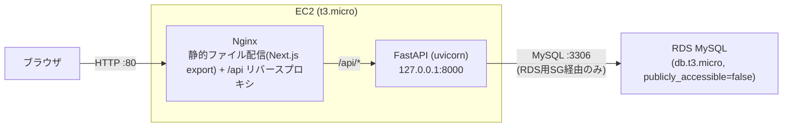

# インフラ構成書(AWS / Terraform)

## 1. 概要

HouseholdBudgetアプリを、AWS上にTerraformで構築する。以下を前提とする。

- 個人利用・単一ユーザー・認証なし(要件定義書の想定を踏襲)
- 必ずAWS無料枠(12ヶ月)の範囲に収まる構成にする
- ロードバランサー・NAT Gateway・ECRなど追加コスト/複雑さの要因となるリソースは作らない
- `terraform apply` だけでEC2作成・ミドルウェアセットアップ・backend/frontendのビルドと起動まで完了する(手動SSH作業なしで再現できる)
- 本構成はTaskManagement(スクール課題アプリ)で得た知見を踏襲している

## 2. アーキテクチャ



- フロントエンド(Next.js)は `output: "export"` で静的ビルドし、バックエンド(FastAPI)と同一EC2に同居させる(ALBを使わないための構成)。現状の実装は100% CSR(Route Handlers・Server Actions・middlewareなし、全ページ `'use client'`)のためNode常駐は不要
- バックエンドAPI(uvicorn)は `127.0.0.1:8000` でのみ待受し、外部には公開しない。ブラウザからは常にNginx経由(`/api/*`)でアクセスする(同一オリジンのためCORS設定は本番では不要)
- RDSはEC2からのみアクセス可能(パブリックアクセス不可、セキュリティグループでEC2のSGからの3306番のみ許可)
- VPCは新規作成せず、アカウントのデフォルトVPC/デフォルトサブネットを利用

## 3. AWSリソース一覧

| リソース | 設定 | 無料枠との関係 |
|----------|------|----------------|
| EC2 | `t3.micro`, Amazon Linux 2023(最新AMIを`data.aws_ami`で動的取得) | 無料枠対象インスタンスタイプ(12ヶ月) |
| RDS | `db.t3.micro`, MySQL, ストレージ20GB gp3, Single-AZ | 無料枠対象インスタンスタイプ・無料枠のストレージ上限(20GB)に合わせている |
| セキュリティグループ(EC2用) | 22(SSH)/80(HTTP)を`var.allowed_cidr`から許可 | バックエンドAPIはNginx経由のみで直接公開しないため8000番は開けていない |
| セキュリティグループ(RDS用) | 3306をEC2のSGからのみ許可 | - |
| キーペア | `tls_private_key`でTerraformが新規生成し`aws_key_pair`に登録 | - |
| サブネットグループ(RDS用) | デフォルトVPCの全サブネット(複数AZ)を登録 | RDSのDBサブネットグループ作成要件(2AZ以上)を満たすため |

作らなかったもの: ロードバランサー、NAT Gateway、ECR、CloudFront、Route53(独自ドメイン)、Multi-AZ、自動バックアップの長期保持。理由はいずれも無料枠超過または個人利用には過剰なため。

## 4. ディレクトリ構成(`terraform/`)

```
terraform/
├── versions.tf                # terraform / 各providerのバージョン制約
├── provider.tf                 # provider "aws" { region = var.aws_region }
├── variables.tf                 # 全変数定義(リージョン、インスタンスタイプ、DB名、許可CIDRなど)
├── data.tf                     # デフォルトVPC/サブネット/AMIのdata source
├── key_pair.tf                  # SSHキーペアの生成・出力
├── security_group.tf             # EC2用セキュリティグループ
├── rds_security_group.tf          # RDS用セキュリティグループ
├── rds.tf                       # DBサブネットグループ・マスターパスワード生成・RDSインスタンス
├── ec2.tf                       # EC2インスタンス(user_dataでアプリまで自動デプロイ)
├── scripts/
│   └── bootstrap.sh.tftpl        # EC2起動時に実行されるセットアップ・デプロイスクリプト(テンプレート)
├── outputs.tf                    # public_ip, DB接続情報などの出力
├── terraform.tfvars.example       # tfvarsのひな形(コミット対象)
└── terraform.tfvars              # 実際の値(gitignore対象)
```

`terraform.tfvars`・`generated/`(生成された秘密鍵)・`*.tfstate`・`*.tfplan`はすべて`.gitignore`で除外している(詳細は7節)。

## 5. デプロイの仕組み(`scripts/bootstrap.sh.tftpl`)

`ec2.tf`で`templatefile()`を使い、RDSの接続情報(`database_url`、SQLAlchemy形式)とリポジトリ情報(`repo_url`/`repo_ref`)をスクリプトに埋め込み、EC2起動時の`user_data`として実行する。主な処理は以下の順序。

1. **ミドルウェア導入**: `dnf`で`nodejs22`・`nodejs22-npm`・`nginx`・`git`を導入し、nginxを起動
2. **swap追加**: `t3.micro`(メモリ1GB)での`npm run build`/Alembic実行時のメモリ不足対策として1GBのswapファイルを作成
3. **uv導入**: Amazon Linux 2023のdnfリポジトリがPython 3.12を提供していない可能性があるため、`uv`のスタンドアロンインストーラを使い、dnfのシステムPythonに依存せず`uv`にPython 3.12自体を管理させる
4. **アプリ取得**: `git clone --branch <repo_ref> --depth 1 <repo_url>`でpublicリポジトリを取得(認証情報不要)
5. **バックエンドのセットアップ・マイグレーション**: `uv sync --no-dev`で依存関係(Python 3.12自体を含む)を導入し、`uv run alembic upgrade head`でスキーマを作成。DB接続情報は`/etc/householdbudget-backend.env`(パーミッション600)に書き出し、マイグレーション実行時・systemdユニットの両方で`DATABASE_URL`として読み込ませる
6. **バックエンドの起動**: `systemd`ユニット(`householdbudget-backend.service`)経由で`uv run uvicorn app.main:app --host 127.0.0.1 --port 8000`を常駐させる
7. **フロントエンドのビルド**: `NEXT_PUBLIC_API_BASE_URL=""`を指定して`npm run build`し、静的エクスポート成果物(`out/`)を`/usr/share/nginx/html/`に配置。ビルド時環境変数`NEXT_PUBLIC_API_BASE_URL`により、本番はNginx経由の相対パス`/api`、ローカル開発(`npm run dev`)は`http://localhost:8000`にフォールバックする([frontend/src/lib/api.ts](../frontend/src/lib/api.ts))
8. **Nginx設定**: `/etc/nginx/nginx.conf`を、静的ファイル配信(`try_files $uri $uri/ /index.html`。Next.jsの`trailingSlash: true`設定によりルートごとに`<route>/index.html`が生成されるため、ディレクトリ index 解決で各ページが配信される)+ `/api/`を`http://127.0.0.1:8000`へリバースプロキシする内容に置き換える

`user_data_replace_on_change = true`のため、`bootstrap.sh.tftpl`やDB接続情報を変更すると次回`terraform apply`時にEC2が作り直される(＝常に最新のuser_dataで再構築される)。

## 6. 運用手順

### 初回構築・再構築

```bash
cd terraform
terraform init
terraform plan -out=tfplan.out
terraform apply tfplan.out
```

apply後、`instance_public_ip`が出力される。アプリのビルドを含むため、起動完了まで数分かかる。以下でuser_dataの完了を待って確認できる。

```bash
ssh -i ./generated/householdbudget-key.pem ec2-user@<instance_public_ip> "cloud-init status --wait; sudo systemctl is-active householdbudget-backend nginx"
```

### アプリのコード変更を反映する

`main`ブランチにマージされたコードを反映したい場合、EC2を作り直す必要がある(user_dataは初回起動時にしか実行されないため)。`bootstrap.sh.tftpl`の内容に変更がなくても、何らかの差分を発生させてEC2を再作成する。

```bash
terraform apply -replace=aws_instance.app
```

### 破棄

学習用途で使い終わったら、無料枠消費・不要なリソース残存を避けるため破棄する。

```bash
terraform destroy
```

## 7. 秘密情報の取り扱い

- **AWS認証情報**(アクセスキー/シークレットキー)はTerraformコード・リポジトリに一切書かない。ローカルの`~/.aws/credentials`(AWS CLIプロファイル)または環境変数から`provider "aws"`に読ませる
- **SSH秘密鍵**(`terraform/generated/`)・**tfstate**(`*.tfstate`、RDSエンドポイント等の機微情報を含む)・**`terraform.tfvars`**はいずれも`.gitignore`で除外している
- **RDSマスターパスワード**は`random_password`で自動生成し、コード上に平文で書かない。ただし現状の実装では、EC2の`user_data`(instance metadata)にパスワードが平文で含まれる。これはAWSアカウント所有者(自分のみ)がAWS API経由で参照可能、またはインスタンス上のIMDS経由でも参照可能というトレードオフを許容した上での設計判断(個人利用・学習目的の一時的な環境のため)。本番相当の運用をする場合はAWS Systems Manager Parameter Store等への切り出しを検討する

## 8. 既知の制限・今後の課題

- **アクセス制限**: `allowed_cidr`は現状`0.0.0.0/0`(全世界許可)になっている。TaskManagementでも同様の判断をした前例(利用回線がCGNAT等でグローバルIPが接続ごとに変動し、単一IPへの絞り込みが機能しなかった)を踏襲し、短期間の学習用途と割り切って許容した。長期運用する場合はVPN経由のアクセスやAWS Client VPN、EC2 Instance Connect Endpoint等の検討が必要
- **HTTPS未対応**: 独自ドメイン・証明書を用意していないため現状HTTPのみ
- **単一AZ・冗長性なし**: 個人利用のため可用性は考慮していない
- **tfstateはローカル管理**: 単一作業者のため。複数人・複数環境で運用する場合はS3バックエンド等への移行が必要
- **CI/CDなし**: `terraform plan`/`apply`は手動実行。GitHub Actions等での自動化は未対応

## 9. 参考

- Terraformコード: [terraform/](../terraform/)
- 技術スタックの選定理由: [docs/basic-design.md 1章](basic-design.md#1-技術スタック)
- TaskManagementのインフラ構成書(本構成の雛形): `../../TaskManagement/docs/infrastructure.md`
